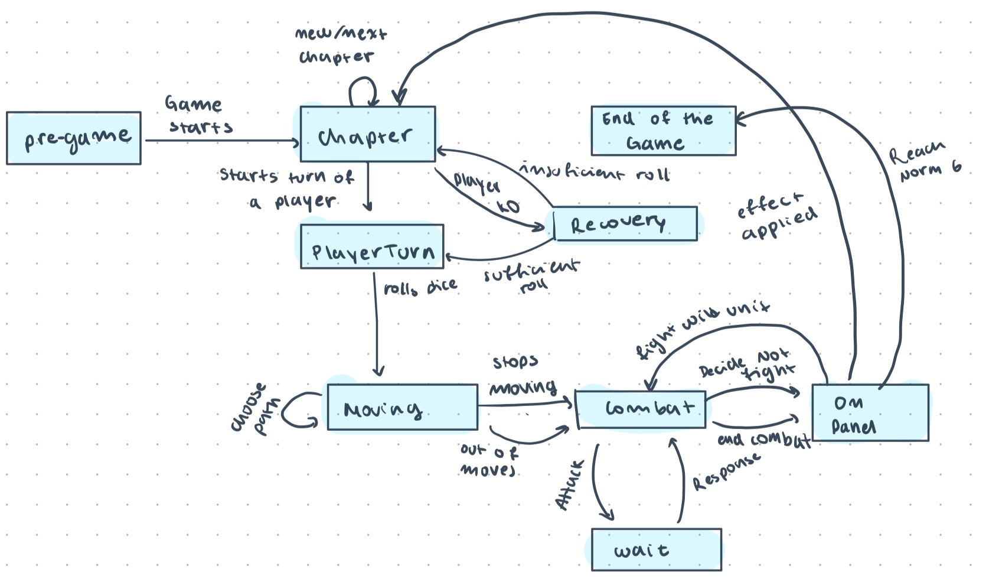

# 99.7% Citric Liquid

## About

`99.7% Citric Liquid` is a simplified clone of the renowned game, `100% Orange Juice`. Its main
purpose is to serve as an educational tool, teaching foundational programming concepts.

📢 **Note**: This project is purely educational and will not be used for any commercial purposes.

---

## T1 - 26/09/23

First, I started with the implementation of different tests. For that I used the testing framework
MUnit and designed the tests for the characteristics (variables and/or values) and methods that each class had to have. 
With that in mind, I started with the concept of the board and the players. For that, I decided to create a trait for the units and use the one of the panels.

Considering that all the panels have two functionalities in common, I implemented the abstract panel class, so that all the different classes
of panel could extend from it, and consequently, make the methods inherited(also the arrays).

We have 5 different panels, all with different effects, so each one has its own class in which I defined their special functionality
(except for the HomePanel and EncounterPanel, due to their complexity they are going to be developed later).

Subsequently, I designed the Board class. Keeping on mind that this was a collection of panels, in this phase the decision of which type
of organization they were going to have was made. For the moment, it consists on simple connections, each panel has two adjacent panels. 

Afterward, the implementation of the different types of units was made. I divided it into the WildUnits and the players.

Each type of Wild Unit has its own class, with their values defined. There wasn't a previous abstract class defined because 
in the future their special functionalities will be addressed, and I'll see if they have some in common or not.

The class for the players has the necessary parameters to save the information of each character and the methods for playing
the dice and be healed, so that they can be used when the situation requires.

Finally, the norm was implemented as an attribute in the PlayerCharacter Class and as a Class. When we address its functionalities, they will be added in the class.

## T2 - 6/11/23

The first thing I did was to review the privacy settings of the methods and attributes already defined in the T1 version of this project.
Regarding the attributes, I generally defined them with 'protected' access modifiers, allowing me to access them within the classes or abstract classes in the hierarchy and some of them I don't really use them(I use the getters or setters) but still use protected so that when they are defined in the trait, I make sure to force their implementation in the classes/abstract classes that extends from them. Also in some traits I defined the abstract methods of the setters and getters because I use them as types and need to access their attributes.
For other attributes, I opted to set them as 'private' if it was possible with my design. Next, I implemented the getters and setters. Getters were set up for every attribute that wasn't public, while setters were only defined for the ones I deemed necessary to modify from other parts of the program.
As for the methods, almost all of them have 'public' access, except for those that serve as helpers for the main methods and some setters, like the one for CurrentStars, these I designated with 'protected' access.

Afterward, I implemented the crucial methods for the combat in this game: 'Attack', 'Defense', and 'Evasion'. I developed them in accordance with the specified rules and conditions. In the case of the 'Attack' method, its behavior depends on the type of unit it received, necessitating the use of Double Dispatch. Additionally, I created a 'GeneralATK' method to streamline code and avoid redundancy. 
Since calculating the attacker's attack is consistent across all units, I utilized this function in the 'Attack' method. Given that we haven't covered user inputs yet, I temporarily defined a method intended to prompt the user for their decision on defending or evading an attack, and each character has booleans to indicate the decision, then this can be changed. Currently, this method doesn't have any functionality, but that's why I placed it in both the 'AttackPlayerCharacter' and 
'AttackWildUnit' methods. Subsequently, after receiving an attack, if a unit's HP drops to zero, the transfer of stars is executed, and we add victories to the victorious character (if that's the case).

For implementing the 'NormCheck' effect in the 'HomePanel', I defined a method specific to each type of 'Norm' to program its upgrade to the next level, except for 'Norm6' which is the final level, thus its 
method remains empty. To avoid redundant code, I also introduced a 'GeneralUpgrade' method. This method takes the character with the 'Norm' we wish to upgrade, as well as the subsequent 'Norm'. The upgrade only proceeds 
if the character fulfills the requirements of the chosen objective, in line with the conditions we established. Since we haven't covered user inputs yet, I defined two booleans for each objective indicating the player's 
choice (these can be modified later). With this setup in place, in the 'NormCheck' method, upon receiving the character affected by the panel, we call the 'upgradeNorm' method on the character's 'CurrentNorm' and it does what it is required to do.

In regard to the implementation of the 'apply' method in the 'NeutralPanel', it is defined in the AbstractPanel as an empty method, meaning it does not perform any specific action. 
In the test for this function, I verified that everything remains unchanged, providing clear evidence that it is well implemented.

Finally, I added an exception to make sure that a combat between two 'WildUnits' does not occur. The reason for this is that the rules and conditions for this 
type of combat were not specified, and therefore, it does not exist in this game.

## States diagram

## T3 - 5/12/23

For this task, what I did was analyze the game flow and interactions between units. With that information, I was able to design the state diagram, which I later used as a base to begin programming.

Next, I proceeded to create the GameController class, which is responsible for ensuring the proper management of what was created in the previous tasks of this course, and establishing a smooth flow. I also created the necessary 
classes and traits to implement the State Pattern, thus modeling the previously designed state diagram. All transitions are properly tested, ensuring correct functionality.

With this groundwork, the connection between these state classes and the controller was established, delegating tasks and making necessary calls to ensure a seamless game. Methods were created to make choices, 
simulating input with the parameters they receive. All of this is also thoroughly tested.

Finally, I implemented the Observer Pattern to ensure the detection of victory conditions. For this, I created a class representing that condition, which receives the name of the winning player, and 
I also implemented the required traits and classes for the model.

As a comment, I didn't implement a view, but I did put some prints with messages so that during the testing of the GameController you can see I little bit
of the flow. Also, for choosing an objective after the NormCheck, I had to set it with a choice, but it is well tested so that you now that
in an input context, it would work just fine.

This project is licensed under the [Creative Commons Attribution 4.0 International License](http://creativecommons.org/licenses/by/4.0/).